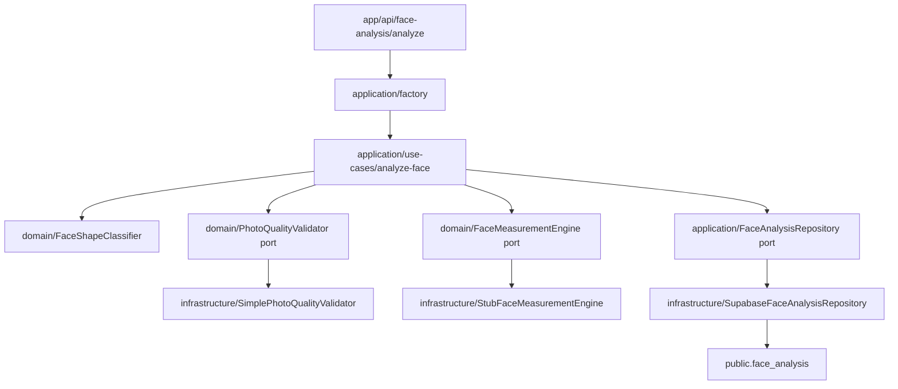

# Face Analysis Module

## Dependency Diagram



## Confidence Score Formula

`FaceShapeClassifier` menghitung beberapa rasio dari measurement:

- `rLen = face_length / average_width`
- `rForeJaw = forehead_width / jaw_width`
- `rCheekJaw = cheekbone_width / jaw_width`
- `rForeCheek = forehead_width / cheekbone_width`
- `widthEvenness = closeness(spreadRatio, 0, tolerance=0.18)`

Setiap face shape memiliki skor 0..1 berdasarkan kedekatan rasio terhadap target rule.
Contoh: `scoreNear(value, target, tolerance) = clamp(1 - abs(value - target) / tolerance, 0, 1)`.

Kategori dengan skor tertinggi menjadi hasil utama. Confidence dihitung dengan penalti ambiguitas:

```txt
topScore = max(categoryScores)
secondScore = secondHighest(categoryScores)
ambiguityPenalty = 1 - clamp(secondScore / max(topScore, 0.000001), 0, 1) * 0.5
confidence = clamp(topScore * ambiguityPenalty * 100, 0, 100)
```

Artinya confidence naik ketika kategori teratas kuat, dan turun ketika kategori kedua terlalu dekat.

## MediaPipe Boundary

Domain layer tidak memiliki dependency ke MediaPipe. Domain hanya mengenal:

- `FaceMeasurementEngine` sebagai port untuk mengambil measurement.
- `PhotoQualityValidator` sebagai port validasi kualitas.
- `FaceShapeClassifier` sebagai rule classifier murni.

Jika MediaPipe ditambahkan, implementasinya harus berada di infrastructure sebagai adapter, misalnya
`infrastructure/engines/mediapipe-face-measurement-engine.ts`, lalu diwiring di factory/API.

## Recommendation Extension Point

Recommendation Engine tidak dicampur ke Face Analysis Module. Face Analysis hanya menghasilkan
`face_shape`, `confidence_score`, dan `analysisId`. Modul recommendation membaca output tersebut melalui
API atau database dan menjalankan `RecommendationService` terpisah.

Extension point yang disiapkan:

- `features/recommendations/domain/RecommendationRuleProvider`
- `features/recommendations/application/RecommendationService`

Provider baru dapat ditambahkan untuk membaca rule dari database, A/B test, atau konfigurasi admin tanpa
mengubah `FaceAnalysisService`.
